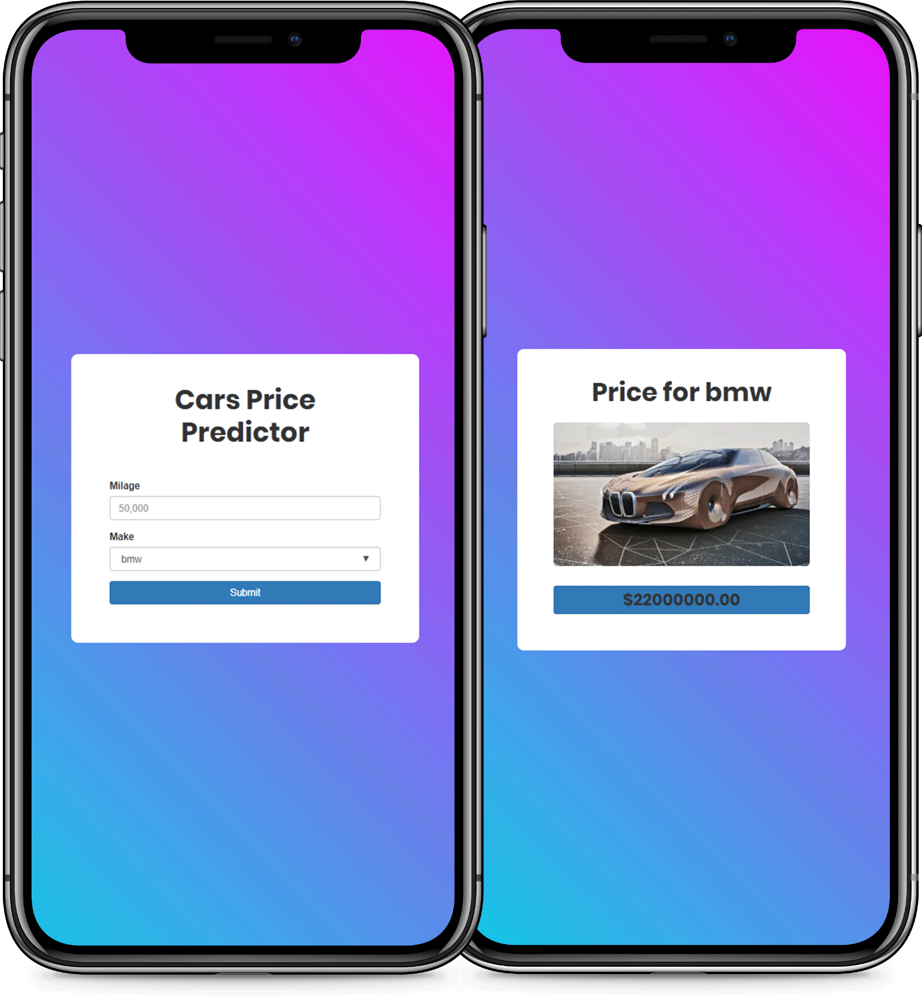

<h1><strong>🚗 Car Price Prediction App💸</strong></h1>
<h4>Figure out the value of your ride</h4>

This is a project to demonstrate my abilities in:
* Data Science
* Web Development
* DevOps

In addition, this project was developed using a __`Scrum`__ workflow.

## Recreate Project
> ##### Recreate the environment
>1. `conda env create -f environment.yml`
>2. `source activate car-prices3.6`

> ##### Launch predictor
>1. `cd app_predictor`
>2. `python app.py &`
> // _The predictor runs on port `8080`_

> ##### Launch UI Client
> 1. `cd app_client`
> 2. `python app.py &`
> // _The UI Client runs on port `5000`_

> ##### Access the Application
> Open your browser and go to [http://127.0.0.1:5000](http://127.0.0.1:5000)

## To-Do
1. Develop Prediction Model
2. Deploy on AWS
3. Add tests and **CI/CD**
4. Add **sign-ups** and **DB**
5. Create feature to recognize a car from a photograph

